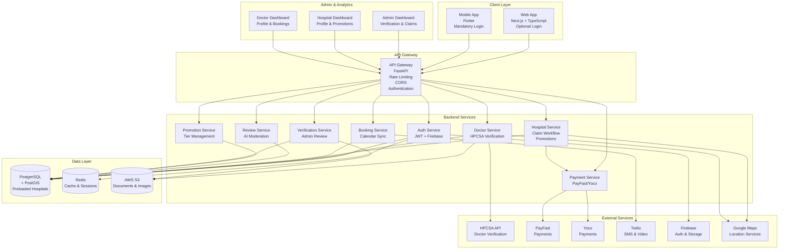

# Rate The Doctor & Hospital - Complete Architecture

## System Architecture Diagram

## Data Flow

### Hospital Claim Flow
1. **Preload**: Hospitals inserted into DB as `claimed=false`
2. **Claim Initiation**: Hospital admin requests claim via email/dashboard
3. **Token Generation**: System generates unique claim token
4. **Email Verification**: Admin receives email with claim link
5. **Document Upload**: Admin uploads license, registration, ID
6. **Admin Review**: Admin verifies documents
7. **Activation**: Hospital marked as `claimed=true`, `verified=true`

### Promotion Purchase Flow
1. **Selection**: Hospital admin selects promotion tier (Standard/Premium)
2. **Payment**: Redirect to PayFast/Yoco checkout
3. **Webhook**: Payment provider sends webhook on success
4. **Activation**: System creates `hospital_promotions` record
5. **Trigger**: Database trigger updates `is_featured=true`
6. **Display**: Hospital appears first in search results

### Search Flow
1. **User Input**: Patient enters search query + filters
2. **API Call**: Frontend calls `/api/hospitals/search`
3. **Filtering**: Backend filters by:
   - City, type, rating
   - `claimed=true` AND `verification_status=verified` (default)
4. **Sorting**: Featured first, then by rating
5. **Response**: Paginated results with hospital details

## Component Descriptions

### Hospital Service
- **Search**: Filtered search with geolocation
- **Claim Management**: Initiate, verify, complete claims
- **Promotion Management**: Purchase, activate, track promotions
- **Profile Management**: Update hospital details, services

### Payment Service
- **Multi-Provider**: Supports PayFast, Yoco, Paystack
- **Webhook Handling**: Secure payment verification
- **Subscription Management**: Recurring payments for promotions
- **Invoice Generation**: PDF invoices for promotions

### Verification Service
- **Admin Dashboard**: Review queue for claims and verifications
- **Document Validation**: Check uploaded documents
- **Approval Workflow**: Approve/reject with notes
- **Audit Logging**: All actions logged

## Security Architecture

- **Authentication**: JWT tokens with refresh mechanism
- **Authorization**: Role-based access (patient, doctor, hospital_admin, admin)
- **Data Encryption**: AES-256 at rest, TLS 1.3 in transit
- **POPIA Compliance**: Data minimization, retention policies, user rights
- **Rate Limiting**: Redis-backed rate limiting per user/IP
- **Audit Trail**: Complete audit log of all actions

## Scalability

- **Horizontal Scaling**: Multiple FastAPI instances behind load balancer
- **Database**: Read replicas for search queries
- **Caching**: Redis for frequently accessed data
- **CDN**: Static assets and images via CDN
- **Queue System**: Background jobs for email/SMS (optional: Celery + RabbitMQ)

