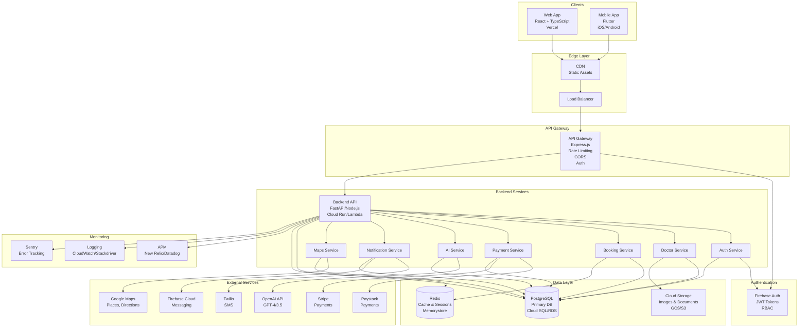
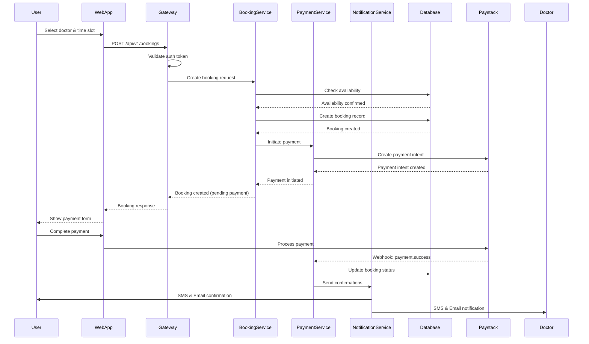
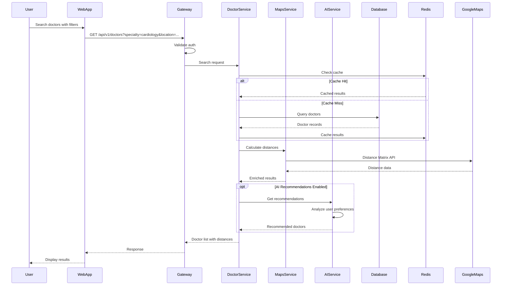
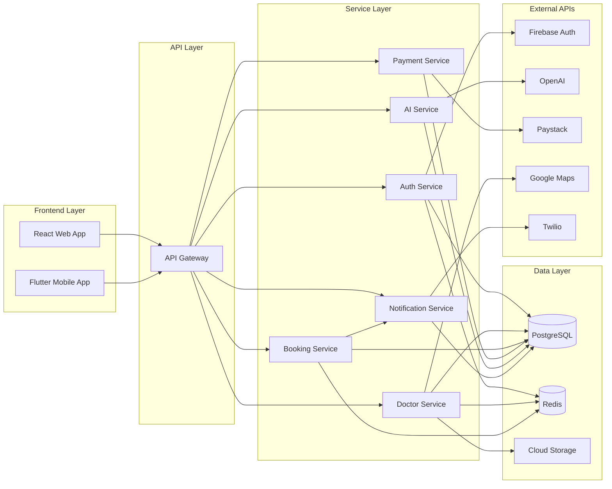
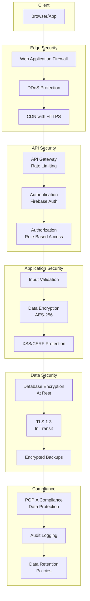
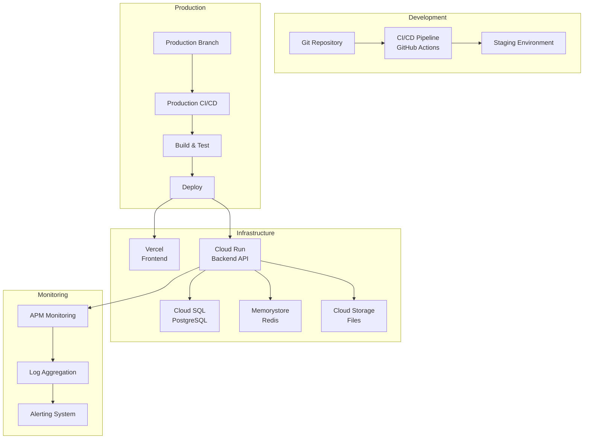
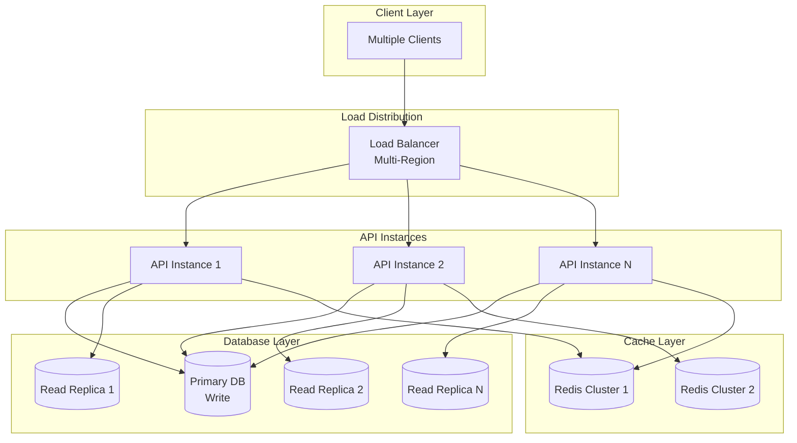
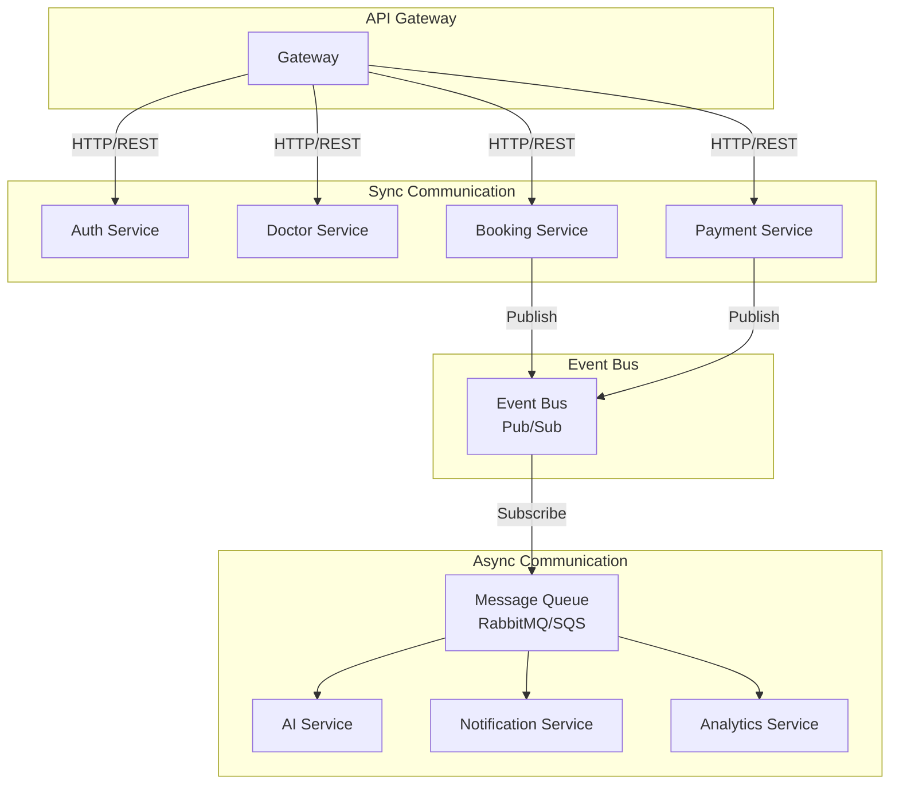

# RateTheDoctor - Architecture Diagrams

This document contains visual architecture diagrams for the RateTheDoctor system.

## System Overview Diagram

## Data Flow Diagram - Booking Creation

## Data Flow Diagram - Doctor Search

## Component Interaction Diagram

## Security Architecture

## Deployment Architecture

## Scalability Diagram

## Microservices Communication

