# Rate The Doctor - Complete System Architecture

## System Overview

Rate The Doctor is a verified medical directory and review platform for South Africa with unified web, Android, and iOS applications sharing a single backend and database.

## Architecture Diagram

```mermaid
graph TB
    subgraph "Client Applications"
        WEB[Web App<br/>Next.js + Tailwind<br/>Optional Login]
        ANDROID[Android App<br/>Flutter<br/>Mandatory Login]
        iOS[iOS App<br/>Flutter<br/>Mandatory Login]
    end

    subgraph "API Gateway"
        GATEWAY[API Gateway<br/>FastAPI<br/>Rate Limiting<br/>CORS]
    end

    subgraph "Authentication Layer"
        FIREBASE[Firebase Auth<br/>JWT Tokens<br/>Refresh Tokens]
    end

    subgraph "Backend Services"
        AUTH_SVC[Auth Service]
        DOCTOR_SVC[Doctor Service<br/>HPCSA Verification]
        USER_SVC[User Verification<br/>3rd Party APIs]
        BOOKING_SVC[Booking Service<br/>Calendar Sync]
        REVIEW_SVC[Review Service<br/>AI Moderation]
        PAYMENT_SVC[Payment Service<br/>PayFast/Yoco]
        AI_SVC[AI Service<br/>Recommendations]
        NOTIFY_SVC[Notification Service]
        ANALYTICS_SVC[Analytics Service]
    end

    subgraph "External APIs"
        HPCSA[HPCSA API<br/>Verification]
        SMILE[Smile Identity<br/>User Verification]
        TRULIOO[Trulioo<br/>User Verification]
        GMAPS[Google Maps<br/>Location Services]
        GCALENDAR[Google Calendar<br/>Appointment Sync]
        TWILIO_VIDEO[Twilio Video<br/>Telehealth]
        PAYFAST[PayFast<br/>Payments]
        YOCO[Yoco<br/>Payments]
        OPENAI[OpenAI<br/>AI Features]
    end

    subgraph "Data Layer"
        POSTGRES[(PostgreSQL<br/>Primary Database<br/>Shared for Web + Mobile)]
        REDIS[(Redis<br/>Cache & Sessions)]
        S3[(AWS S3<br/>Documents & Images)]
    end

    subgraph "Admin & Analytics"
        ADMIN[Admin Panel<br/>Next.js]
        DOCTOR_DASH[Doctor Dashboard<br/>Analytics]
    end

    WEB --> GATEWAY
    ANDROID --> GATEWAY
    iOS --> GATEWAY
    ADMIN --> GATEWAY
    DOCTOR_DASH --> GATEWAY

    GATEWAY --> FIREBASE
    GATEWAY --> AUTH_SVC
    GATEWAY --> DOCTOR_SVC
    GATEWAY --> USER_SVC
    GATEWAY --> BOOKING_SVC
    GATEWAY --> REVIEW_SVC
    GATEWAY --> PAYMENT_SVC
    GATEWAY --> AI_SVC
    GATEWAY --> NOTIFY_SVC
    GATEWAY --> ANALYTICS_SVC

    AUTH_SVC --> FIREBASE
    AUTH_SVC --> POSTGRES
    DOCTOR_SVC --> HPCSA
    DOCTOR_SVC --> POSTGRES
    DOCTOR_SVC --> S3
    USER_SVC --> SMILE
    USER_SVC --> TRULIOO
    USER_SVC --> POSTGRES
    BOOKING_SVC --> GCALENDAR
    BOOKING_SVC --> TWILIO_VIDEO
    BOOKING_SVC --> POSTGRES
    REVIEW_SVC --> OPENAI
    REVIEW_SVC --> POSTGRES
    PAYMENT_SVC --> PAYFAST
    PAYMENT_SVC --> YOCO
    PAYMENT_SVC --> POSTGRES
    AI_SVC --> OPENAI
    AI_SVC --> POSTGRES
    NOTIFY_SVC --> POSTGRES

    DOCTOR_SVC --> GMAPS
    BOOKING_SVC --> GMAPS

    AUTH_SVC --> REDIS
    BOOKING_SVC --> REDIS

    DOCTOR_SVC --> S3
    USER_SVC --> S3
```



## Folder Structure

```
ratethedoctor/
├── backend/                      # FastAPI Backend (Shared)
│   ├── app/
│   │   ├── __init__.py
│   │   ├── main.py              # FastAPI app
│   │   ├── config.py            # Configuration
│   │   ├── database.py          # DB connection
│   │   │
│   │   ├── api/                 # API Routes
│   │   │   ├── v1/
│   │   │   │   ├── auth.py      # Authentication
│   │   │   │   ├── doctors.py   # Doctor endpoints
│   │   │   │   ├── users.py     # User endpoints
│   │   │   │   ├── bookings.py  # Booking endpoints
│   │   │   │   ├── reviews.py   # Review endpoints
│   │   │   │   ├── payments.py  # Payment endpoints
│   │   │   │   ├── analytics.py # Analytics endpoints
│   │   │   │   └── admin.py     # Admin endpoints
│   │   │
│   │   ├── models/              # SQLAlchemy Models
│   │   │   ├── user.py
│   │   │   ├── doctor.py
│   │   │   ├── appointment.py
│   │   │   ├── review.py
│   │   │   ├── subscription.py
│   │   │   └── analytics.py
│   │   │
│   │   ├── schemas/             # Pydantic Schemas
│   │   │   ├── user.py
│   │   │   ├── doctor.py
│   │   │   ├── booking.py
│   │   │   └── review.py
│   │   │
│   │   ├── services/            # Business Logic
│   │   │   ├── auth_service.py
│   │   │   ├── doctor_service.py
│   │   │   ├── user_verification_service.py
│   │   │   ├── booking_service.py
│   │   │   ├── review_service.py
│   │   │   ├── payment_service.py
│   │   │   ├── ai_service.py
│   │   │   ├── notification_service.py
│   │   │   └── analytics_service.py
│   │   │
│   │   ├── adapters/            # External API Adapters
│   │   │   ├── hpcsa_adapter.py
│   │   │   ├── smile_identity_adapter.py
│   │   │   ├── trulioo_adapter.py
│   │   │   ├── google_maps_adapter.py
│   │   │   ├── google_calendar_adapter.py
│   │   │   ├── twilio_video_adapter.py
│   │   │   ├── payfast_adapter.py
│   │   │   ├── yoco_adapter.py
│   │   │   └── openai_adapter.py
│   │   │
│   │   ├── middleware/          # Middleware
│   │   │   ├── auth.py          # JWT auth
│   │   │   ├── rate_limit.py   # Rate limiting
│   │   │   └── error_handler.py
│   │   │
│   │   └── utils/              # Utilities
│   │       ├── encryption.py   # POPIA encryption
│   │       ├── validation.py
│   │       └── helpers.py
│   │
│   ├── alembic/                # Database Migrations
│   │   ├── versions/
│   │   └── env.py
│   │
│   ├── tests/                  # Tests
│   │   ├── unit/
│   │   ├── integration/
│   │   └── e2e/
│   │
│   ├── requirements.txt
│   ├── Dockerfile
│   └── .env.example
│
├── web-frontend/                # Next.js Web App
│   ├── app/                    # Next.js App Router
│   │   ├── layout.tsx
│   │   ├── page.tsx            # Landing (no login required)
│   │   ├── search/             # Browse doctors
│   │   ├── doctor/[id]/        # Doctor profile
│   │   ├── login/              # Optional login
│   │   ├── dashboard/          # User dashboard
│   │   ├── admin/              # Admin panel
│   │   └── doctor-portal/      # Doctor dashboard
│   │
│   ├── components/             # React Components
│   │   ├── layout/
│   │   ├── doctor/
│   │   ├── booking/
│   │   ├── review/
│   │   └── admin/
│   │
│   ├── lib/                    # Utilities
│   │   ├── api.ts             # API client
│   │   ├── auth.ts            # Firebase Auth
│   │   └── utils.ts
│   │
│   ├── public/
│   ├── package.json
│   ├── tailwind.config.js
│   └── next.config.js
│
├── mobile-app/                  # Flutter Mobile App
│   ├── lib/
│   │   ├── main.dart
│   │   │
│   │   ├── screens/           # App Screens
│   │   │   ├── auth/         # Login required
│   │   │   │   ├── login_screen.dart
│   │   │   │   └── signup_screen.dart
│   │   │   ├── home/         # Home after login
│   │   │   ├── search/       # Doctor search
│   │   │   ├── doctor/       # Doctor profile
│   │   │   ├── booking/      # Booking flow
│   │   │   ├── reviews/      # Review submission
│   │   │   ├── appointments/ # My appointments
│   │   │   └── doctor_dashboard/ # Doctor dashboard
│   │   │
│   │   ├── widgets/          # Reusable Widgets
│   │   │   ├── doctor_card.dart
│   │   │   ├── booking_calendar.dart
│   │   │   └── review_form.dart
│   │   │
│   │   ├── services/         # Services
│   │   │   ├── api_service.dart
│   │   │   ├── auth_service.dart
│   │   │   ├── storage_service.dart
│   │   │   └── notification_service.dart
│   │   │
│   │   ├── models/           # Data Models
│   │   │   ├── user.dart
│   │   │   ├── doctor.dart
│   │   │   ├── appointment.dart
│   │   │   └── review.dart
│   │   │
│   │   └── providers/        # State Management
│   │       ├── auth_provider.dart
│   │       ├── doctor_provider.dart
│   │       └── booking_provider.dart
│   │
│   ├── pubspec.yaml
│   └── android/ios/          # Platform-specific
│
├── shared/                     # Shared Code
│   ├── api/                   # API Contracts
│   │   ├── types.ts
│   │   └── endpoints.ts
│   └── constants/            # Shared Constants
│
├── docker/                     # Docker Configs
│   ├── docker-compose.yml
│   ├── Dockerfile.backend
│   ├── Dockerfile.web
│   └── nginx.conf
│
├── docs/                      # Documentation
│   ├── API.md
│   ├── DEPLOYMENT.md
│   └── ARCHITECTURE.md
│
└── README.md
```

## Key Architectural Decisions

### 1. Unified Backend
- Single FastAPI backend serves both web and mobile
- Shared PostgreSQL database ensures data consistency
- Same API endpoints for all clients
- JWT tokens work across platforms

### 2. Authentication Strategy
- **Web**: Optional login (browse without login, login for booking/reviews)
- **Mobile**: Mandatory login (Firebase Auth + JWT)
- Refresh tokens for long-lived sessions
- Single sign-on across platforms

### 3. Data Synchronization
- Real-time sync via WebSocket/SSE for critical updates
- Optimistic UI updates with conflict resolution
- Redis cache for frequently accessed data
- Local storage in mobile for offline support

### 4. Verification System
- **Doctors**: HPCSA API + manual document upload
- **Users**: 3rd-party verification (Smile Identity/Trulioo)
- Multi-step verification workflows
- Admin approval queue

### 5. Scalability
- Horizontal scaling with load balancers
- Database read replicas
- CDN for static assets
- Caching strategy (Redis, CDN)

## Cross-Platform Sync Strategy

### Shared Database
- Single PostgreSQL instance
- Row-level security by user/role
- Consistent data across all platforms

### API Consistency
- Same endpoint structure for web and mobile
- Versioned API (`/api/v1/`)
- Standardized request/response formats

### Real-Time Updates
- WebSocket connections for live updates
- Push notifications for mobile
- Event-driven architecture for notifications

## Security & POPIA Compliance

### Data Protection
- AES-256 encryption at rest
- TLS 1.3 for data in transit
- PII encryption in database
- Secure document storage (S3 with encryption)

### Access Control
- Role-based access control (RBAC)
- JWT with refresh tokens
- API rate limiting
- Input validation and sanitization

### POPIA Compliance
- Data minimization (only collect necessary data)
- Consent management
- Right to access/deletion
- Data retention policies
- Audit logging

## Deployment Architecture

### Production Environment
- **Backend**: AWS ECS/Fargate or Google Cloud Run
- **Database**: AWS RDS (PostgreSQL) or Cloud SQL
- **Web Frontend**: Vercel or AWS CloudFront
- **Mobile**: App Store + Google Play
- **Storage**: AWS S3 or Google Cloud Storage
- **CDN**: CloudFront or Cloudflare

### Monitoring
- Application monitoring (CloudWatch, Datadog)
- Error tracking (Sentry)
- Log aggregation (CloudWatch Logs)
- Performance monitoring (APM)

