# RateTheDoctor - Entity Relationship Diagram (ERD)

## Database Schema Overview

The RateTheDoctor system uses PostgreSQL as the primary database with Prisma ORM for type-safe database access. The schema supports multi-tenancy, role-based access, and comprehensive features for doctor management, bookings, reviews, and payments.

## Entity Relationship Diagram

```mermaid
erDiagram
    User ||--o| Doctor : "has"
    User ||--o| Hospital : "has"
    User ||--o| Admin : "has"
    User ||--o{ Review : "writes"
    User ||--o{ Booking : "creates"
    User ||--o{ Verification : "requests"
    User ||--o{ DocBotChat : "initiates"
    User ||--o{ CompanyEmployee : "can_be"
    User ||--o{ MarketplaceOrder : "places"
    User ||--o{ MarketplaceReview : "writes"

    Doctor ||--o{ Review : "receives"
    Doctor ||--o{ Booking : "has"
    Doctor ||--o{ HospitalDoctor : "works_at"
    Doctor ||--o{ DoctorSubscription : "has"
    Doctor ||--o{ DoctorAnalytics : "has"

    Hospital ||--o{ Review : "receives"
    Hospital ||--o{ HospitalDoctor : "employs"
    Hospital ||--o{ HospitalSubscription : "has"
    Hospital ||--o{ HospitalAnalytics : "has"

    Booking ||--|| Commission : "generates"
    Booking ||--o| TelemedicineSession : "has"

    DoctorSubscription }o--|| Doctor : "belongs_to"
    HospitalSubscription }o--|| Hospital : "belongs_to"

    CompanyAccount ||--o{ CompanyEmployee : "has"
    CompanyAccount ||--o{ CompanyAnalytics : "has"

    MarketplaceProduct ||--o{ MarketplaceOrder : "ordered_via"
    MarketplaceProduct ||--o{ MarketplaceReview : "reviewed_via"

    User {
        string id PK
        string email UK
        string password
        string firstName
        string lastName
        string phone
        string role
        string verificationStatus
        boolean isActive
        datetime createdAt
        datetime updatedAt
    }

    Doctor {
        string id PK
        string userId FK
        string hpcsaNumber UK
        string specialization
        int experience
        string practiceAddress
        string practiceCity
        string practiceProvince
        string title
        string bio
        string profilePicture
        float averageRating
        int totalReviews
        float consultationFee
        boolean isAvailable
        string subscriptionLevel
        datetime subscriptionExpiry
        boolean telemedicineEnabled
        datetime createdAt
        datetime updatedAt
    }

    Hospital {
        string id PK
        string userId FK
        string name
        string registrationNumber
        string address
        string city
        string province
        float latitude
        float longitude
        string type
        boolean verified
        boolean autoPopulated
        float averageRating
        int totalReviews
        string subscriptionLevel
        datetime createdAt
        datetime updatedAt
    }

    Review {
        string id PK
        string userId FK
        string doctorId FK
        string hospitalId FK
        int rating
        string comment
        boolean isVerified
        boolean isReported
        datetime createdAt
        datetime updatedAt
    }

    Booking {
        string id PK
        string doctorId FK
        string patientId FK
        datetime appointmentDate
        string appointmentTime
        int duration
        boolean isTelemedicine
        string status
        string paymentStatus
        float consultationFee
        float platformFee
        float totalAmount
        string paymentIntentId
        string patientNotes
        string doctorNotes
        datetime createdAt
        datetime updatedAt
    }

    Verification {
        string id PK
        string userId FK
        string role
        string status
        string documents
        string reviewedBy
        datetime reviewedAt
        string rejectionReason
        datetime createdAt
        datetime updatedAt
    }

    Admin {
        string id PK
        string userId FK
        int level
        boolean isActive
        datetime createdAt
        datetime updatedAt
    }

    Commission {
        string id PK
        string bookingId FK
        float amount
        float percentage
        string status
        datetime paidAt
        datetime createdAt
        datetime updatedAt
    }

    DocBotChat {
        string id PK
        string userId FK
        string sessionId
        string userMessage
        string botResponse
        string doctorType
        string searchQuery
        datetime createdAt
    }

    DoctorSubscription {
        string id PK
        string doctorId FK
        string plan
        string status
        datetime startDate
        datetime endDate
        float amount
        string currency
        string paymentMethod
        string paymentId
        string billingCycle
        datetime createdAt
        datetime updatedAt
    }

    HospitalSubscription {
        string id PK
        string hospitalId FK
        string plan
        string status
        datetime startDate
        datetime endDate
        float amount
        string currency
        string paymentMethod
        string paymentId
        string billingCycle
        datetime createdAt
        datetime updatedAt
    }

    CompanyAccount {
        string id PK
        string companyName
        string contactEmail
        string contactPhone
        string industry
        int employeeCount
        string plan
        string status
        datetime startDate
        datetime endDate
        float amount
        string currency
        int maxEmployees
        boolean analyticsEnabled
        boolean prioritySupport
        datetime createdAt
        datetime updatedAt
    }

    CompanyEmployee {
        string id PK
        string companyId FK
        string userId FK
        string employeeEmail
        string firstName
        string lastName
        string department
        string position
        boolean isActive
        int bookingsCount
        datetime lastBookingDate
        datetime createdAt
        datetime updatedAt
    }

    HospitalDoctor {
        string id PK
        string hospitalId FK
        string doctorId FK
        boolean isActive
        datetime joinedAt
    }

    MarketplaceProduct {
        string id PK
        string name
        string description
        string category
        string subcategory
        float price
        string currency
        float discountPrice
        boolean isOnSale
        string vendorName
        string sku UK
        int stock
        string images
        string videoUrl
        string affiliateLink
        float commissionRate
        boolean isActive
        boolean isFeatured
        string slug UK
        datetime createdAt
        datetime updatedAt
    }

    MarketplaceOrder {
        string id PK
        string productId FK
        string userId FK
        int quantity
        float unitPrice
        float totalAmount
        string currency
        string customerEmail
        string customerName
        string shippingAddress
        string paymentMethod
        string paymentId
        string paymentStatus
        string shippingStatus
        string trackingNumber
        float commissionAmount
        boolean commissionPaid
        datetime createdAt
        datetime updatedAt
    }

    MarketplaceReview {
        string id PK
        string productId FK
        string userId FK
        int rating
        string title
        string comment
        boolean isVerified
        datetime createdAt
        datetime updatedAt
    }

    DoctorAnalytics {
        string id PK
        string doctorId FK
        string period
        datetime periodStart
        datetime periodEnd
        int profileViews
        int bookingRequests
        int completedBookings
        int cancelledBookings
        int newReviews
        float averageRating
        float consultationRevenue
        float telemedicineRevenue
        float totalRevenue
        string ageGroups
        string genderDistribution
        string topSpecialties
        datetime createdAt
    }

    HospitalAnalytics {
        string id PK
        string hospitalId FK
        string period
        datetime periodStart
        datetime periodEnd
        int profileViews
        int searchAppearances
        int bookingRequests
        int completedBookings
        int newReviews
        float averageRating
        float totalRevenue
        float commissionEarned
        string topDepartments
        string ageGroups
        string genderDistribution
        datetime createdAt
    }

    CompanyAnalytics {
        string id PK
        string companyId FK
        string period
        datetime periodStart
        datetime periodEnd
        int activeEmployees
        int totalBookings
        float totalSpend
        float averageBookingValue
        string topSpecialties
        string topHospitals
        string bookingTrends
        datetime createdAt
    }

    TelemedicineSession {
        string id PK
        string bookingId FK
        string sessionId
        string provider
        string roomUrl
        datetime scheduledStart
        datetime actualStart
        datetime actualEnd
        int duration
        string status
        boolean patientJoined
        boolean doctorJoined
        string recordingUrl
        string connectionQuality
        string technicalIssues
        datetime createdAt
        datetime updatedAt
    }
```

## Key Relationships

### User Relationships
- **One-to-One**: User can be a Doctor, Hospital, or Admin
- **One-to-Many**: User can write multiple Reviews, create multiple Bookings
- **Optional**: User may not have a Doctor/Hospital/Admin profile

### Doctor Relationships
- **One-to-Many**: Doctor can have multiple Reviews, Bookings, Subscriptions
- **Many-to-Many**: Doctors can work at multiple Hospitals (via HospitalDoctor)
- **One-to-One**: Doctor subscription level determines features

### Booking Relationships
- **Many-to-One**: Booking belongs to one Doctor and one Patient (User)
- **One-to-One**: Booking can generate one Commission
- **One-to-One**: Booking can have one TelemedicineSession

### Subscription Relationships
- **One-to-Many**: Doctor/Hospital can have multiple subscription records (history)
- **Current Subscription**: Determined by most recent active subscription

### Analytics Relationships
- **One-to-Many**: Doctor/Hospital/Company can have multiple analytics records
- **Time-based**: Analytics records are created per period (daily, weekly, monthly, yearly)

## Database Indexes

### Primary Indexes
- `User.id` (Primary Key)
- `User.email` (Unique Index)
- `Doctor.id` (Primary Key)
- `Doctor.userId` (Unique Index)
- `Doctor.hpcsaNumber` (Unique Index)
- `Booking.id` (Primary Key)

### Foreign Key Indexes
- `Booking.doctorId` (Index for joins)
- `Booking.patientId` (Index for joins)
- `Review.doctorId` (Index for joins)
- `Review.userId` (Index for joins)

### Composite Indexes
- `HospitalDoctor(hospitalId, doctorId)` (Unique composite)
- `Booking(doctorId, appointmentDate, appointmentTime)` (For availability queries)
- `Review(doctorId, createdAt)` (For review listing)

### Full-Text Search Indexes
- `Doctor.specialization` (GIN index for search)
- `Hospital.name` (GIN index for search)
- `Review.comment` (GIN index for search)

## Data Constraints

### Business Rules
1. **Booking Constraints**:
   - Cannot book same time slot twice for same doctor
   - Booking must be in future
   - Patient must be verified user

2. **Review Constraints**:
   - User can only review after completed booking
   - One review per booking
   - Rating must be between 1-5

3. **Subscription Constraints**:
   - Only one active subscription per doctor/hospital
   - Subscription expiry must be in future
   - Amount must be positive

4. **Verification Constraints**:
   - Doctor must have valid HPCSA number
   - Documents required for verification
   - Verification status: PENDING, APPROVED, REJECTED

## Database Migrations

Prisma migrations are used to manage schema changes:
- Initial schema creation
- Version control for schema changes
- Rollback capabilities
- Data migration scripts

## Backup & Recovery

- **Daily Backups**: Automated daily backups
- **Point-in-Time Recovery**: 30-day retention
- **Disaster Recovery**: Multi-region backup copies
- **Data Encryption**: At-rest encryption (AES-256)

