# Section 1: Architecture Overview

## Purpose
This section defines the system architecture, component interactions, and deployment strategy for RateTheDoctor.

## Architecture Diagram

```mermaid
graph TB
    subgraph "Client Layer"
        WEB[Next.js Web App<br/>Vercel]
        MOBILE[Flutter Mobile App<br/>iOS/Android]
        ADMIN[Admin Dashboard<br/>Next.js]
    end

    subgraph "API Gateway"
        GATEWAY[API Gateway<br/>Rate Limiting<br/>CORS<br/>Auth]
    end

    subgraph "Backend Services"
        API[Backend API<br/>FastAPI/Node.js<br/>Cloud Run/Lambda]
        
        subgraph "Core Services"
            AUTH_SVC[Auth Service<br/>Firebase/JWT]
            DOCTOR_SVC[Doctor Service<br/>CRUD + Search]
            BOOKING_SVC[Booking Service<br/>Appointments]
            REVIEW_SVC[Review Service<br/>Ratings]
            PAYMENT_SVC[Payment Service<br/>Subscriptions]
        end
        
        subgraph "External Adapters"
            HPCSA_ADAPTER[HPCSA Adapter<br/>Mock/Real]
            MAPS_ADAPTER[Maps Adapter<br/>Mock/Real]
            PAYMENT_ADAPTER[Payment Adapter<br/>Paystack/Stripe]
        end
        
        subgraph "AI Services"
            AI_SVC[AI Service<br/>OpenAI]
            SYMPTOM_CHECKER[Symptom Checker]
            REVIEW_CLASSIFIER[Review Classifier]
        end
        
        subgraph "Notification Services"
            SMS_SVC[SMS Service<br/>Twilio]
            EMAIL_SVC[Email Service<br/>SendGrid]
            PUSH_SVC[Push Service<br/>FCM]
        end
    end

    subgraph "Data Layer"
        POSTGRES[(PostgreSQL<br/>PostGIS<br/>Primary DB)]
        REDIS[(Redis<br/>Cache & Sessions)]
        S3[(S3/Cloud Storage<br/>Documents & Images)]
    end

    subgraph "External APIs"
        FIREBASE[Firebase Auth]
        OPENAI[OpenAI API]
        GMAPS[Google Maps API]
        PAYSTACK[Paystack API]
        STRIPE[Stripe API]
        TWILIO[Twilio API]
        SENDGRID[SendGrid API]
    end

    WEB --> GATEWAY
    MOBILE --> GATEWAY
    ADMIN --> GATEWAY
    
    GATEWAY --> API
    
    API --> AUTH_SVC
    API --> DOCTOR_SVC
    API --> BOOKING_SVC
    API --> REVIEW_SVC
    API --> PAYMENT_SVC
    
    AUTH_SVC --> FIREBASE
    AUTH_SVC --> POSTGRES
    AUTH_SVC --> REDIS
    
    DOCTOR_SVC --> POSTGRES
    DOCTOR_SVC --> HPCSA_ADAPTER
    DOCTOR_SVC --> S3
    
    BOOKING_SVC --> POSTGRES
    BOOKING_SVC --> REDIS
    BOOKING_SVC --> SMS_SVC
    BOOKING_SVC --> EMAIL_SVC
    
    REVIEW_SVC --> POSTGRES
    REVIEW_SVC --> AI_SVC
    
    PAYMENT_SVC --> PAYMENT_ADAPTER
    PAYMENT_SVC --> POSTGRES
    
    HPCSA_ADAPTER -->|Mock Mode| HPCSA_ADAPTER
    HPCSA_ADAPTER -->|Real Mode| HPCSA_API
    
    MAPS_ADAPTER -->|Mock Mode| MAPS_ADAPTER
    MAPS_ADAPTER -->|Real Mode| GMAPS
    
    PAYMENT_ADAPTER -->|Mock Mode| PAYMENT_ADAPTER
    PAYMENT_ADAPTER -->|Paystack| PAYSTACK
    PAYMENT_ADAPTER -->|Stripe| STRIPE
    
    AI_SVC --> SYMPTOM_CHECKER
    AI_SVC --> REVIEW_CLASSIFIER
    SYMPTOM_CHECKER --> OPENAI
    REVIEW_CLASSIFIER --> OPENAI
    
    SMS_SVC --> TWILIO
    EMAIL_SVC --> SENDGRID
    PUSH_SVC --> FIREBASE
    
    API --> POSTGRES
    API --> REDIS
    API --> S3
```



## Component Descriptions

### Client Layer

#### Next.js Web App
- **Framework**: Next.js 14 (App Router)
- **Styling**: Tailwind CSS
- **Language**: TypeScript
- **Hosting**: Vercel
- **Features**:
  - Server-side rendering (SSR)
  - Static site generation (SSG)
  - API routes for serverless functions
  - Progressive Web App (PWA)

#### Flutter Mobile App
- **Framework**: Flutter 3.x
- **Language**: Dart
- **Platforms**: iOS & Android
- **Features**:
  - Native performance
  - Offline capabilities
  - Push notifications
  - Location services

#### Admin Dashboard
- **Framework**: Next.js 14
- **Features**:
  - Doctor verification workflow
  - Patient verification review
  - Analytics dashboard
  - Content moderation

### API Gateway

- **Purpose**: Single entry point for all client requests
- **Features**:
  - Rate limiting
  - CORS handling
  - Authentication middleware
  - Request/Response logging
  - API versioning

### Backend Services

#### Core Services
- **Auth Service**: Authentication, authorization, session management
- **Doctor Service**: Doctor CRUD, search, verification
- **Booking Service**: Appointment management, availability
- **Review Service**: Review creation, validation, moderation
- **Payment Service**: Subscription management, payment processing

#### External Adapters (Mock/Real)
- **HPCSA Adapter**: Doctor credential verification
- **Maps Adapter**: Location services, geocoding
- **Payment Adapter**: Payment processing (Paystack/Stripe)

#### AI Services
- **Symptom Checker**: AI-powered symptom analysis
- **Review Classifier**: Sentiment analysis, categorization

#### Notification Services
- **SMS Service**: Twilio integration
- **Email Service**: SendGrid integration
- **Push Service**: Firebase Cloud Messaging

### Data Layer

#### PostgreSQL
- **Primary Database**: PostgreSQL 15+
- **Extensions**: PostGIS (geospatial queries)
- **ORM**: Prisma (Node.js) or SQLAlchemy (Python)

#### Redis
- **Purpose**: Caching, session storage, rate limiting
- **Use Cases**:
  - API response caching
  - User sessions
  - Rate limit counters
  - Real-time availability

#### S3/Cloud Storage
- **Purpose**: Document and image storage
- **Use Cases**:
  - Doctor profile images
  - Verification documents
  - Medical certificates
  - Practice licenses

## Data Flow

### User Registration Flow
```
User → Next.js/Flutter → API Gateway → Auth Service → Firebase Auth
                                                      → PostgreSQL (User record)
                                                      → Redis (Session)
                                                      → SMS/Email Service (OTP)
```

### Doctor Verification Flow
```
Doctor → Next.js → API Gateway → Doctor Service → HPCSA Adapter (Mock/Real)
                                                              → PostgreSQL (Verification request)
                                                              → Admin Dashboard (if manual review)
                                                              → Notification Service (Status update)
```

### Booking Flow
```
Patient → Next.js/Flutter → API Gateway → Booking Service → PostgreSQL (Check availability)
                                                           → PostgreSQL (Create booking)
                                                           → Payment Service → Payment Adapter
                                                           → Notification Service (Confirmations)
```

### Review Submission Flow
```
Patient → Next.js/Flutter → API Gateway → Review Service → PostgreSQL (Validate appointment)
                                                          → PostgreSQL (Create review)
                                                          → AI Service (Sentiment analysis)
                                                          → Doctor Service (Update ratings)
```

## Deployment Architecture

### Production Environment
- **Frontend**: Vercel (automatic deployments)
- **Backend**: Google Cloud Run / AWS Lambda (serverless)
- **Database**: Cloud SQL (PostgreSQL) / RDS
- **Cache**: Cloud Memorystore (Redis) / ElastiCache
- **Storage**: Google Cloud Storage / S3

### Development Environment
- **Local**: Docker Compose for all services
- **Staging**: Separate cloud environment

## Scalability Considerations

1. **Horizontal Scaling**: Stateless API services
2. **Database Scaling**: Read replicas, connection pooling
3. **Caching Strategy**: Multi-layer caching (Redis, CDN)
4. **Load Balancing**: Application load balancers
5. **Auto-scaling**: Cloud Run / Lambda auto-scaling
6. **Message Queue**: RabbitMQ / AWS SQS for async processing

## Security Architecture

1. **Authentication**: Firebase Auth or JWT with refresh tokens
2. **Authorization**: Role-based access control (RBAC)
3. **Data Encryption**: AES-256 at rest, TLS 1.3 in transit
4. **Input Validation**: All inputs validated and sanitized
5. **Rate Limiting**: API rate limiting to prevent abuse
6. **POPIA Compliance**: Data protection, retention policies

