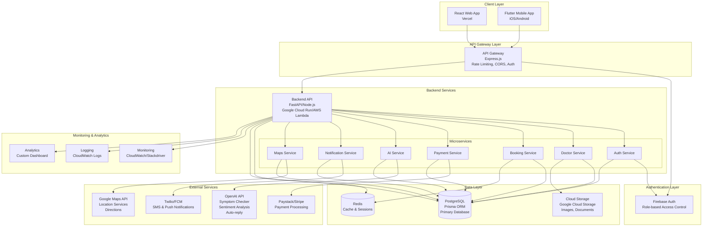

# RateTheDoctor - System Architecture

## Overview

RateTheDoctor is a production-grade, AI-powered doctor locator, rating, and booking platform for South Africa. The system is designed to be modular, scalable, and maintainable with future extensions for telemedicine and pharmacy delivery.

## Architecture Diagram



## System Components

### 1. Client Layer

#### Web Application (React)
- **Framework**: React 18 with TypeScript
- **Hosting**: Vercel
- **Features**:
  - Responsive design with Tailwind CSS
  - Real-time updates with WebSocket/SSE
  - Progressive Web App (PWA) capabilities
  - SEO optimization

#### Mobile Application (Flutter)
- **Framework**: Flutter (Dart)
- **Platforms**: iOS & Android
- **Features**:
  - Native performance
  - Offline capabilities
  - Push notifications
  - Location services

### 2. API Gateway Layer

- **Technology**: Express.js / Kong / AWS API Gateway
- **Functions**:
  - Request routing
  - Rate limiting
  - CORS handling
  - Authentication middleware
  - Request/Response transformation
  - API versioning

### 3. Authentication Layer

- **Provider**: Firebase Authentication
- **Features**:
  - Email/Password authentication
  - Social login (Google, Facebook)
  - Phone number authentication
  - Role-based access control (User, Doctor, Admin)
  - JWT token management
  - Session management

### 4. Backend Services

#### Core API Service
- **Option 1**: FastAPI (Python)
  - High performance async operations
  - Automatic API documentation
  - Type validation with Pydantic
  
- **Option 2**: Node.js with Express
  - JavaScript ecosystem consistency
  - Large package ecosystem
  - Easy integration with existing services

#### Microservices Architecture

1. **Auth Service**
   - User registration/login
   - Token generation/validation
   - Role management
   - Session handling

2. **Doctor Service**
   - Doctor profile management
   - Specialization handling
   - Verification workflow
   - Profile analytics

3. **Booking Service**
   - Appointment scheduling
   - Availability management
   - Calendar integration
   - Booking confirmations

4. **Payment Service**
   - Payment processing
   - Subscription management
   - Invoice generation
   - Refund handling

5. **AI Service**
   - Symptom checker
   - Review sentiment analysis
   - Auto-reply suggestions
   - Doctor recommendations

6. **Notification Service**
   - SMS notifications (Twilio)
   - Push notifications (FCM)
   - Email notifications
   - In-app notifications

7. **Maps Service**
   - Location search
   - Route calculation
   - Distance calculations
   - Geocoding

### 5. Data Layer

#### PostgreSQL Database
- **ORM**: Prisma (TypeScript) or SQLAlchemy (Python)
- **Features**:
  - ACID compliance
  - Complex queries
  - Full-text search
  - JSONB support
  - Connection pooling

#### Redis Cache
- **Usage**:
  - Session storage
  - API response caching
  - Rate limiting counters
  - Real-time data

#### Cloud Storage
- **Provider**: Google Cloud Storage / AWS S3
- **Usage**:
  - Doctor profile images
  - Medical documents
  - Verification documents
  - Chat attachments

### 6. External Services Integration

#### OpenAI API
- **Use Cases**:
  - Symptom checker chatbot
  - Review sentiment analysis
  - Auto-reply generation for doctors
  - Medical information summarization

#### Google Maps API
- **Features**:
  - Doctor location display
  - Route directions
  - Distance calculation
  - Geocoding/Reverse geocoding
  - Places API integration

#### Payment Gateway
- **Paystack** (Africa-focused)
  - Card payments
  - Bank transfers
  - Mobile money
  - Recurring subscriptions
  
- **Stripe** (Alternative)
  - International payments
  - Subscription management
  - Marketplace payments

#### Notification Services
- **Twilio**
  - SMS notifications
  - WhatsApp messages
  - Voice calls
  
- **Firebase Cloud Messaging (FCM)**
  - Push notifications
  - In-app messaging

### 7. Security & Compliance

#### POPIA Compliance
- **Data Protection**:
  - Encrypted data storage (AES-256)
  - Encrypted data in transit (TLS 1.3)
  - Data retention policies
  - Right to access/deletion
  - Consent management
  
- **Security Measures**:
  - Input validation
  - SQL injection prevention
  - XSS protection
  - CSRF tokens
  - Rate limiting
  - DDoS protection
  - Regular security audits

### 8. Monitoring & Analytics

- **Application Monitoring**: CloudWatch / Stackdriver
- **Logging**: Centralized logging with ELK stack
- **Error Tracking**: Sentry
- **Performance Monitoring**: APM tools
- **Analytics Dashboard**: Custom analytics for doctors and admins

## Data Flow

### User Registration Flow
```
User → React/Flutter App → API Gateway → Auth Service → Firebase Auth
                                                      → PostgreSQL (User record)
                                                      → Redis (Session)
                                                      → Notification Service (Welcome email/SMS)
```

### Doctor Search Flow
```
User → React/Flutter App → API Gateway → Doctor Service → PostgreSQL (Search)
                                                         → Redis (Cache)
                                                         → Maps Service → Google Maps API
                                                         → AI Service → OpenAI (Recommendations)
```

### Booking Flow
```
User → React/Flutter App → API Gateway → Booking Service → PostgreSQL (Create booking)
                                                          → Payment Service → Paystack/Stripe
                                                          → Notification Service → SMS/Email
                                                          → AI Service → Confirmation message
```

### Review Submission Flow
```
User → React/Flutter App → API Gateway → Doctor Service → PostgreSQL (Store review)
                                                        → AI Service → OpenAI (Sentiment analysis)
                                                        → Notification Service → Doctor notification
```

## Scalability Considerations

1. **Horizontal Scaling**: Stateless API services for easy scaling
2. **Database Scaling**: Read replicas, connection pooling, query optimization
3. **Caching Strategy**: Multi-layer caching (Redis, CDN)
4. **Load Balancing**: Application load balancers
5. **Auto-scaling**: Cloud Run / Lambda auto-scaling
6. **Message Queue**: RabbitMQ / AWS SQS for async processing

## Deployment Architecture

### Production Environment
- **Frontend**: Vercel (CDN, automatic deployments)
- **Backend**: Google Cloud Run / AWS Lambda (serverless)
- **Database**: Cloud SQL (PostgreSQL) / RDS
- **Cache**: Cloud Memorystore (Redis) / ElastiCache
- **Storage**: Cloud Storage / S3
- **Monitoring**: CloudWatch / Stackdriver

### CI/CD Pipeline
```
GitHub → GitHub Actions → Build & Test → Deploy to Staging → Tests → Deploy to Production
```

## Future Extensions

1. **Telemedicine**
   - Video consultation integration (Zoom, Agora)
   - Prescription management
   - E-prescription system

2. **Pharmacy Delivery**
   - Pharmacy integration
   - Delivery tracking
   - Prescription verification

3. **Health Records**
   - Patient health records
   - Medical history
   - Insurance integration

4. **Insurance Integration**
   - Medical aid verification
   - Claim processing
   - Coverage checking

